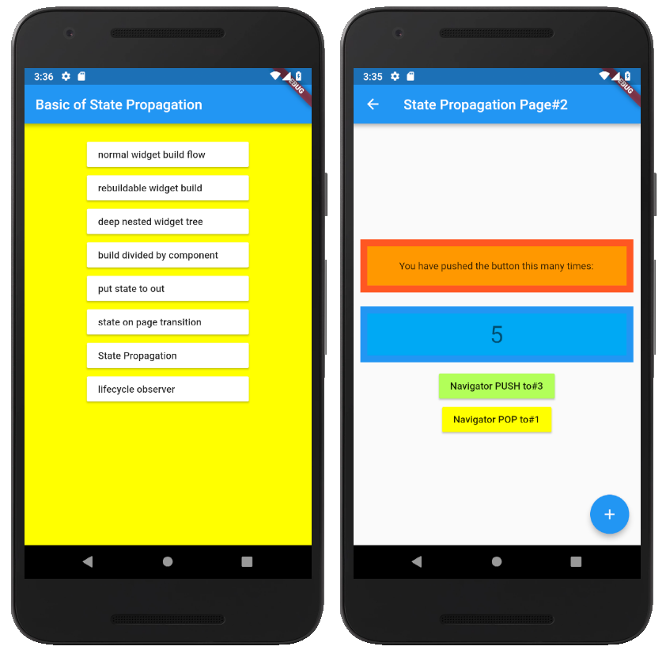

# Basic Strategy of State Propagation and Access Restriction in Flutter

[DroidKaigi 2019](https://droidkaigi.jp/2019/timetable/70887)  
DAY.02 (Feb 8th, 2019)  
JA Room 6 － 2019/02/08 17:40-18:10  
初心者歓迎 クロスプラットフォーム  
FlutterでのWidgetツリーへの状態伝播とアクセス制限の基本戦略 のサンプルソースです。

## サンプルソースについて

Flutterのネストが深くならないように気をつけたり、
基本ウィジェット (*1) のみを使った、アプリ全体での状態や
ロジックの共有とアクセスの制限について説明します

_初学者が対象ですので、BLOCなど応用技術の説明ではありません。_
- 基本ウィジェット：InheritedWidget

## サンプルアプリについて

サンプルソースは、個別のアプリとしてラウンチャーで起動できるようになっています。  
サンプルソースでは、ビルドフローの変化を Android Studio などのログ出力で確認できるよう、
Scaffold や Text ウィジェットなどをラップした MyScaffold や MyText ウィジェットを使っていることに留意ください。

- サンプルソース選択画面＆実行画面  

