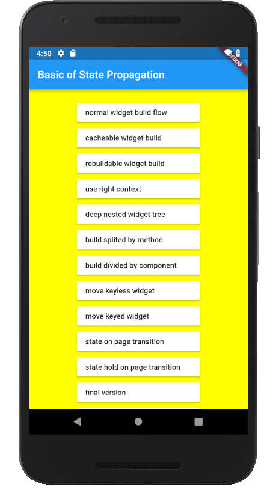
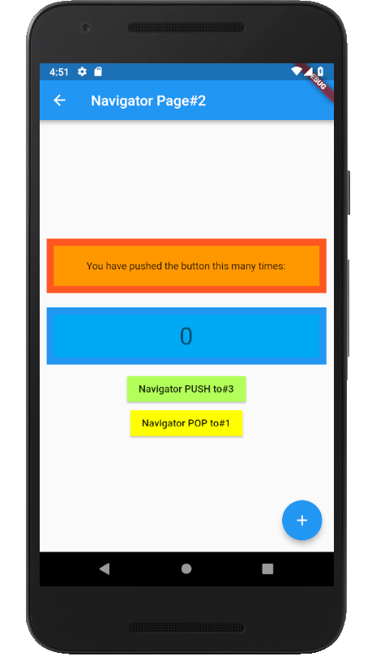

# Basic Strategy of State Propagation and Access Restriction in Flutter

[DroidKaigi 2019](https://droidkaigi.jp/2019/timetable/70887)  
DAY.02 (Feb 8th, 2019)  
JA Room 6 － 2019/02/08 17:40-18:10  
初心者歓迎 クロスプラットフォーム  
FlutterでのWidgetツリーへの状態伝播とアクセス制限の基本戦略 のサンプルソースです。

## サンプルアプリについて

Flutterの Hello World であるカウンタアプリを例にして、
基本ウィジェットやメソッドのみを使った、アプリ全体での情報やロジックの共有とアクセスの制限のサンプルソースを実行するアプリです。

サンプルソースでは、ビルドフローの変化を Android Studio などのログ出力で確認できるよう、
Scaffold や Text ウィジェットなどをラップした MyScaffold や MyText ウィジェットを使っていることに留意ください。

- ラウンチャー (サンプルソース選択画面)  

− サンプルソース実行画面 (state on page transition)  

_初学者が対象ですので、BLOCなど応用技術の説明ではありません。_
- 基本ウィジェット：StatelessWidget, StatefulWidget, InheritedWidget
